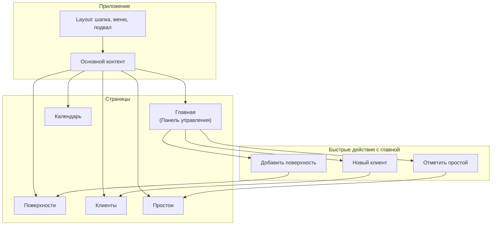
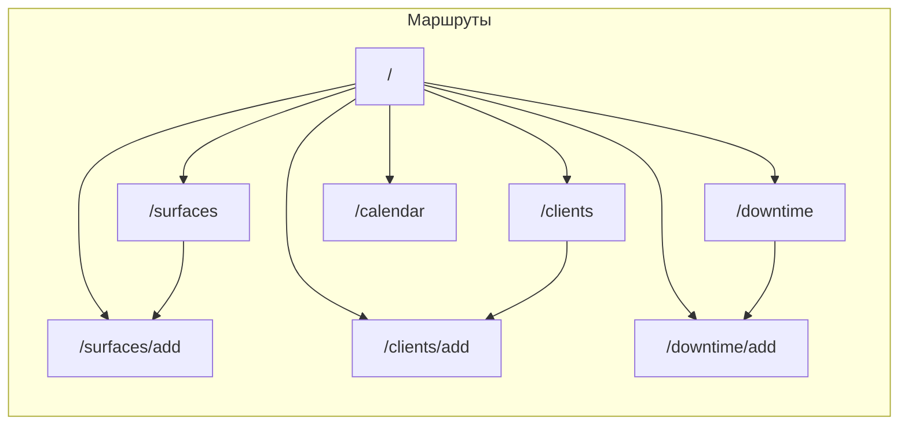
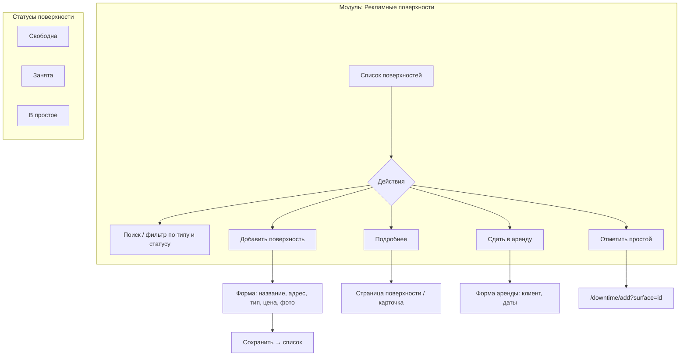
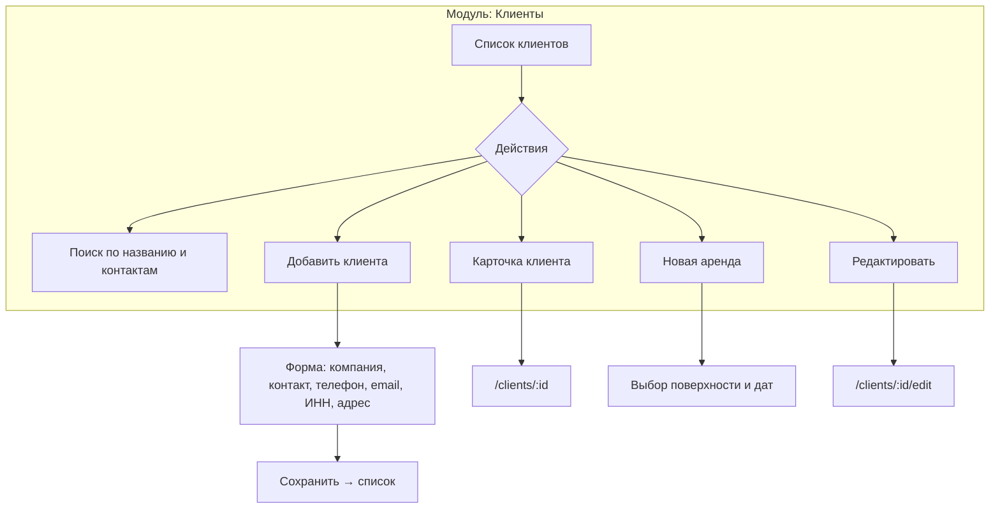
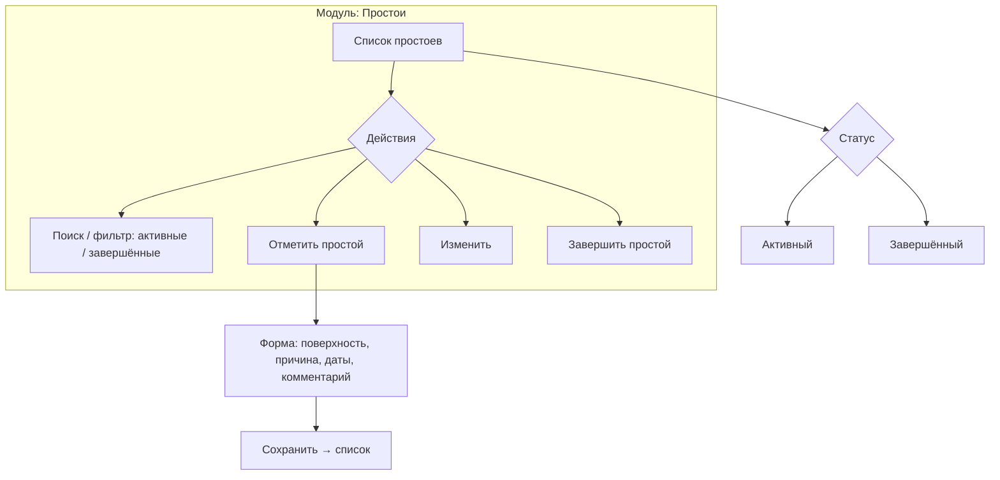
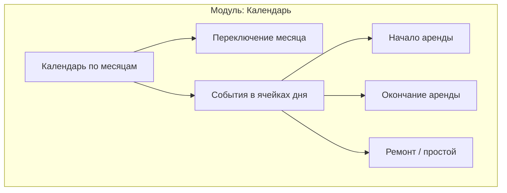
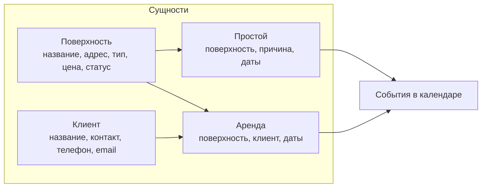
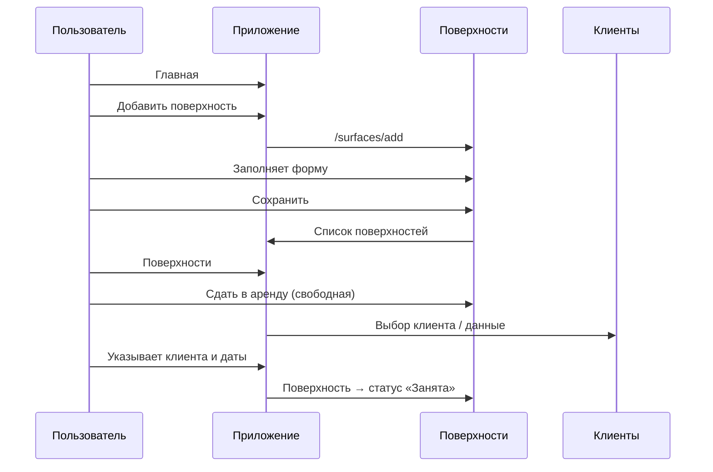
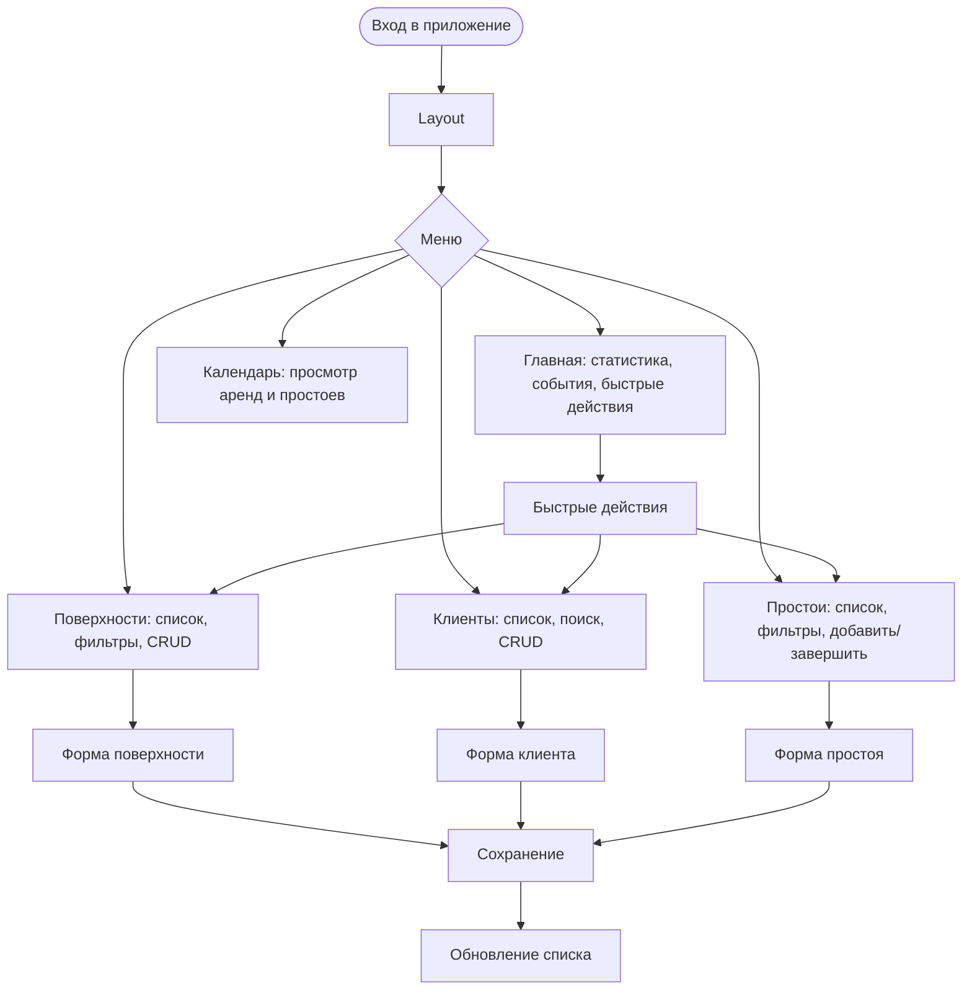

# Функциональная модель приложения Surface Manager

Блок-схемы структуры и сценариев использования.

---

## 1. Общая структура приложения

---

## 2. Навигация и маршруты

---

## 3. Модуль «Поверхности»

---

## 4. Модуль «Клиенты»

---

## 5. Модуль «Простои»

---

## 6. Модуль «Календарь»

---

## 7. Связи сущностей (данные)

---

## 8. Сценарий: добавление поверхности и аренда

---

## 9. Сводная блок-схема функций

---

Файл можно открыть в любом редакторе с поддержкой Mermaid (VS Code с расширением, GitHub, Notion и т.п.) или сгенерировать изображение через [Mermaid Live Editor](https://mermaid.live).
